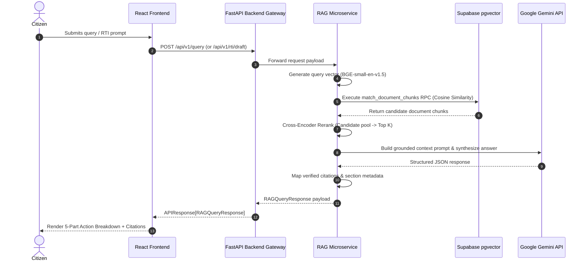

# CivicAI (Disha) 🏛️✨
> **Action-Oriented Civic Guidance & Statutory RTI Drafting Platform**

CivicAI (Disha) is an end-to-end, production-grade civic empowerment platform that converts complex, opaque legal and bureaucratic procedures into clear, actionable, and statutory-backed guidance for citizens.

---

## 📋 Table of Contents
1. [Overview & Core Value Proposition](#-overview--core-value-proposition)
2. [Detailed Feature Guide](#-detailed-feature-guide)
3. [Deep-Dive System Architecture](#-deep-dive-system-architecture)
4. [RAG & RTI Generation Pipeline](#-rag--rti-generation-pipeline)
5. [Database & Vector Store Schema](#-database--vector-store-schema)
6. [Design System & Editorial Aesthetic](#-design-system--editorial-aesthetic)
7. [Repository Structure](#-repository-structure)
8. [Installation & Local Setup](#-installation--local-setup)
9. [Complete API Reference](#-complete-api-reference)
10. [Cloud Deployment Guide (Vercel + Render)](#-cloud-deployment-guide-vercel--render)
11. [Testing & Verification](#-testing--verification)

---

## 🌟 Overview & Core Value Proposition

Citizens frequently face administrative delays, unreturned security deposits, defective consumer goods, and unanswered public inquiries. Traditional search engines return generic legal articles, while raw LLMs risk hallucinating non-existent statutory sections.

**CivicAI bridges the gap between "something went wrong" and "what do I do now?"** by enforcing **Strict Statutory Grounding**:

* 🚫 **No Hallucinated Laws**: Every option and document requirement is tied to verified legal citations (e.g., *Right to Information Act 2005*, *Consumer Protection Act 2019*).
* ⚡ **Action Over Abstention**: Rather than displaying passive text summaries, CivicAI provides an actionable 5-part breakdown and immediate 1-click document creation.
* 🛡️ **Privacy & Accessibility**: Works without complex sign-ups, offers low-bandwidth assets, and maintains a dark/light civic editorial interface.

---

## 🛠️ Detailed Feature Guide

### 1. 🤖 Action-Oriented Grounded Guidance Engine
When a citizen enters a problem in natural language (e.g., *"My landlord hasn't returned my deposit after 2 months"*), CivicAI produces a structured 5-part response:

1. 🧠 **What We Understood**: Concise restatement of the user's factual situation.
2. 🎯 **What You Can Do**: Step-by-step numbered legal action plan.
3. 📋 **What You'll Need**: Checklist of required evidence (receipts, lease agreements, messages).
4. 🚀 **Next Step**: Concrete immediate step with a 1-click button to trigger formal RTI or complaint generation.
5. 📜 **Verified Statutory Citations**: Exact legal acts, issuing authorities, sections, and official government URLs.

### 2. 📜 Statutory RTI Drafting Agent
Converts informal information requests into legally binding Right to Information (RTI) applications formatted under **Section 6(1) of the RTI Act, 2005**:
* Identifies the appropriate **Public Information Officer (PIO)** and Public Authority.
* Formulates precise, numbered information requests to prevent administrative rejection.
* Automatically includes statutory 30-day response timeline warnings under Section 7(1).

### 3. 🗺️ Interactive Rights Navigator
Allows users to explore options step-by-step across 6 core categories:
* **Housing**: Security deposits, tenancy notices, repair obligations.
* **Consumer Rights**: Product refunds, defective goods, misleading service claims.
* **Workplace**: Unpaid wages, employment contracts, leave disputes.
* **Government Services**: Delayed public services, administrative grievances.
* **RTI Requests**: Public record inquiries, project expenditure audits.
* **Welfare & Schemes**: Eligibility checks, missing benefit payments.

### 4. 📝 Guided Form Sessions & Legal Complaint Generator
An interactive document builder that guides citizens through creating:
* Formal Consumer Complaints under the *Consumer Protection Act, 2019*.
* Tenant Deposit Refund Demands under relevant State Rent Control Acts.
* Municipal Grievance Representation letters.

### 5. 📁 Document Workspace & Exporter
* Saved document library stored in local browser state and optional database session.
* Copy-to-clipboard and text file export with backend download handlers.
* Full-screen preview with side-by-side legal metadata and limitations notice.

### 6. ⚡ 1-Click Evaluation Test Prompts
Pre-configured test prompts embedded in the UI for instant demonstration:
* *1. Consumer Rights Overview*
* *2. PM Kisan Scheme Eligibility*
* *3. How to File an RTI Application*
* *4. Ward 5 Road Repair Expenditure Audit*

---

## 🏗️ Deep-Dive System Architecture

CivicAI uses a decoupled, hybrid-cloud microservice architecture designed for high availability and low resource usage:

```mermaid
graph TD
    subgraph Client Tier (Vercel)
        A["💻 React 18 + Vite SPA"] -->|HTTPS / Axios| B["⚡ FastAPI Gateway (Serverless)"]
    end

    subgraph Backend Orchestration Tier (Vercel Serverless)
        B -->|Session & Auth| C[("🗄️ Supabase PostgreSQL")]
        B -->|HTTP Async Proxy| D["🤖 RAG AI Microservice (Render)"]
    end

    subgraph RAG Microservice Tier (Render)
        D -->|Vector Similarity RPC| C
        D -->|Grounded LLM Prompt| E["✨ Google Gemini API"]
        D -->|BGE Embedder| F["🔍 Semantic Search & Citations"]
    end
```

### Module Responsibilities

1. **Frontend (`/frontend`)**: React + Vite single-page app serving the user interface, managing state, handling theme transitions, and rendering dynamic citations.
2. **Main Backend Gateway (`/backend`)**: FastAPI serverless orchestrator that handles user profiles, session state, form validation, and proxies requests to the RAG microservice.
3. **RAG Microservice (`/rag`)**: Autonomous Python service responsible for legal chunking, semantic retrieval, cross-encoder reranking, LLM answer synthesis, and citation mapping.

---

## 🔄 RAG & RTI Generation Pipeline



---

## 🗄️ Database & Vector Store Schema

Legal documents (Acts, Rules, Guidelines, Schemes) are chunked and stored in Supabase PostgreSQL using the `pgvector` extension.

### `document_chunks` Table Schema

| Column Name | Type | Description |
| :--- | :--- | :--- |
| `id` | `uuid` (PK) | Unique primary key |
| `chunk_id` | `text` (Unique) | Composite identifier (`<doc_id>_<index>`) |
| `document_id` | `text` | Document identifier (e.g., `rti_act_2005`) |
| `content` | `text` | Factual text snippet of the legal chunk |
| `embedding` | `vector(384)` | L2-normalized BGE vector embedding |
| `document_title` | `text` | Official document title |
| `document_type` | `text` | Category (`law`, `scheme`, `rule`, `guide`) |
| `issuing_authority` | `text` | Government ministry or parliament |
| `chapter` | `text` | Chapter reference |
| `section` | `text` | Section provision (e.g., `Section 6(1)`) |
| `page_start` | `integer` | Start page number in statutory PDF |
| `page_end` | `integer` | End page number in statutory PDF |
| `source_url` | `text` | Official government source URL |

### Vector Search RPC Function (`match_document_chunks`)
```sql
CREATE OR REPLACE FUNCTION match_document_chunks(
  query_embedding vector(384),
  match_count int DEFAULT 5,
  filter_document_id text DEFAULT NULL,
  filter_document_type text DEFAULT NULL,
  filter_issuing_authority text DEFAULT NULL
)
RETURNS TABLE (
  chunk_id text,
  document_id text,
  content text,
  similarity_score float,
  document_title text,
  document_type text,
  issuing_authority text,
  section text,
  source_url text
)
LANGUAGE plpgsql
AS $$
BEGIN
  RETURN QUERY
  SELECT
    dc.chunk_id,
    dc.document_id,
    dc.content,
    1 - (dc.embedding <=> query_embedding) AS similarity_score,
    dc.document_title,
    dc.document_type,
    dc.issuing_authority,
    dc.section,
    dc.source_url
  FROM document_chunks dc
  WHERE
    (filter_document_id IS NULL OR dc.document_id = filter_document_id)
    AND (filter_document_type IS NULL OR dc.document_type = filter_document_type)
    AND (filter_issuing_authority IS NULL OR dc.issuing_authority = filter_issuing_authority)
  ORDER BY dc.embedding <=> query_embedding
  LIMIT match_count;
END;
$$;
```

---

## 🎨 Design System & Editorial Aesthetic

CivicAI implements a bespoke **Civic Editorial Design System** designed to reduce cognitive stress during legal crises:

* **Color Palette**:
  * 📜 **Paper Ivory**: `#FAFAF8` (Light surface)
  * ⬛ **Charcoal Graphite**: `#121316` (Dark surface / primary text)
  * 🟧 **Saffron Amber**: `#D97706` (Primary action cues & interactive markers)
  * 🌿 **Emerald Success**: `#10B981` (Verified citation indicators)
* **Typography**: Clean sans-serif hierarchy paired with uppercase monospace metadata tags (`mono`).
* **Visual FX**: Glassmorphic panels, scroll-replay reveal triggers, seamless dark/light veil transition state animations.

---

## 📁 Repository Structure

```text
OOSC/
├── api/
│   └── index.py                # Vercel Serverless Function entrypoint
├── backend/                    # FastAPI Main Orchestration Backend
│   ├── app/
│   │   ├── api/
│   │   │   ├── deps.py         # FastAPI Dependency Injectors
│   │   │   └── v1/             # Endpoints (/query, /rti, /complaints, /forms)
│   │   ├── config.py           # Pydantic Settings Configuration
│   │   ├── database/           # Supabase Data Repositories
│   │   ├── integrations/       # RAG HTTP Client Integration
│   │   ├── main.py             # FastAPI App Factory & Middleware
│   │   ├── schemas/            # Pydantic Request/Response Models
│   │   └── services/           # Domain Business Logic Services
│   └── requirements.txt
├── frontend/                   # React + Vite Web Application
│   ├── client/
│   │   ├── index.html
│   │   ├── src/
│   │   │   ├── App.tsx         # Main Views & Navigation Router
│   │   │   ├── index.css       # Civic Editorial CSS Design Tokens
│   │   │   ├── main.tsx        # Application Mount Point
│   │   │   └── lib/
│   │   │       ├── api.ts      # Typed Axios Client (19 API Endpoints)
│   │   │       └── trpc.ts     # Decoupled tRPC Client Contract
│   └── package.json
├── rag/                        # RAG AI Microservice
│   ├── app/
│   │   ├── api/                # FastAPI Endpoints (/query, /health)
│   │   ├── chunking/           # Statutory Document Chunker
│   │   ├── citations/          # Legal Citation Mapper
│   │   ├── embeddings/         # BGE Embedder with Low-RAM Fallback
│   │   ├── generation/         # Grounded Gemini Answer Generator
│   │   ├── reranking/          # Cross-Encoder Reranker
│   │   ├── retrieval/          # Semantic Retriever & pgvector Interface
│   │   ├── vector_store/       # Supabase Client Integration
│   │   └── pipeline.py         # End-to-End RAG Pipeline Orchestrator
│   └── requirements.txt
├── vercel.json                 # Vercel Deployment Schema
├── start_all.sh                # Local Orchestration Launcher
└── README.md
```

---

## 💻 Installation & Local Setup

### Prerequisites
* **Node.js** >= 18.x
* **Python** >= 3.10
* **Git**

### 1. Clone & Environment Configuration
```bash
git clone https://github.com/PatelShaurya/OOSC.git
cd OOSC
```

Create a root `.env` file:
```env
# Backend Gateway Config
PROJECT_NAME="CivicAI Backend"
ENVIRONMENT="development"
API_V1_STR="/api/v1"
CORS_ALLOWED_ORIGINS="http://localhost:5173,http://localhost:3000"

# External RAG Microservice URL
RAG_SERVICE_URL="http://127.0.0.1:8001"

# Supabase Credentials
SUPABASE_URL="https://your-supabase-project.supabase.co"
SUPABASE_KEY="your-anon-key"
SUPABASE_SERVICE_KEY="your-service-role-key"

# Gemini API Key
GEMINI_API_KEY="your-gemini-api-key"
```

### 2. Launch Stack via Script
```bash
chmod +x start_all.sh
./start_all.sh
```

---

## 📡 Complete API Reference

### 1. RAG Grounded Query (`POST /api/v1/query`)
**Request**:
```json
{
  "query": "What rights does a consumer have if a product is defective?",
  "top_k": 5,
  "candidate_k": 10
}
```
**Response**:
```json
{
  "success": true,
  "data": {
    "query": "What rights does a consumer have if a product is defective?",
    "answer": "Under Section 2(9) of the Consumer Protection Act, 2019...",
    "what_we_understood": "Defective product purchased by consumer.",
    "what_you_can_do": [
      "Issue formal written notice to seller",
      "File complaint before District Consumer Disputes Redressal Commission"
    ],
    "what_you_need": [
      "Proof of purchase invoice",
      "Photos/videos of defect",
      "Written communication history"
    ],
    "next_step": "Draft legal notice or Consumer Complaint.",
    "citations": [
      {
        "source_id": "cpa_2019_sec_2",
        "document_id": "consumer_protection_act_2019",
        "document_title": "Consumer Protection Act, 2019",
        "document_type": "law",
        "issuing_authority": "Parliament of India",
        "section": "Section 2(9)",
        "source_url": "https://consumeraffairs.nic.in/"
      }
    ]
  },
  "message": "Query processed successfully"
}
```

### 2. Draft RTI Application (`POST /api/v1/rti/draft`)
**Request**:
```json
{
  "request": "Information regarding road repair expenditure in Ward 5 during 2025",
  "applicant_name": "Shaurya Patel",
  "public_authority": "Public Information Officer, Municipal Corporation"
}
```
**Response**:
```json
{
  "success": true,
  "data": {
    "draft": "RTI APPLICATION\n\nTo,\nThe Public Information Officer...",
    "limitations": "Verify PIO designation and fee submission requirements.",
    "citations": [...]
  },
  "message": "RTI application draft generated successfully"
}
```

---

## ☁️ Cloud Deployment Guide (Vercel + Render)

### 1. Vercel (Frontend + FastAPI Gateway)
1. Import repository into Vercel.
2. Set **Build Command**: `cd frontend && npm install --legacy-peer-deps && npx vite build`
3. Set **Output Directory**: `frontend/dist`
4. Add Environment Variables:
   - `RAG_SERVICE_URL` = `https://disha-iy4t.onrender.com`
   - `SUPABASE_URL` = `https://<your-project>.supabase.co`
   - `SUPABASE_KEY` = `<your-key>`

### 2. Render (RAG Microservice)
1. Create a **Web Service** on Render.
2. Set **Root Directory**: `(Leave empty / project root)`
3. Set **Build Command**: `pip install --upgrade pip && pip install -r rag/requirements.txt`
4. Set **Start Command**: `PYTHONPATH=. python -m uvicorn rag.app.api.main:app --host 0.0.0.0 --port $PORT`
5. Set Environment Variables for Low-RAM Operation:
   - `DISABLE_LOCAL_TORCH` = `true`
   - `DISABLE_RERANKER` = `true`
   - `EMBEDDING_DIM` = `384`

---

## 🧪 Testing & Verification

Run the end-to-end Python test suite:

```bash
# Run backend integration tests
pytest backend/tests/test_e2e_integration.py

# Run RTI drafting tests
pytest backend/tests/test_rti_drafting.py

# Run RAG microservice unit tests
pytest rag/tests/
```

---

## 🛡️ License & Disclaimer

CivicAI (Disha) is an open-source civic empowerment tool. Information provided by the platform is synthesized directly from official public statutory records for guidance purposes and does not constitute formal legal representation. Citizens should verify local administrative filing procedures before submitting claims.

---
Made with ❤️ by team Agra Metro
